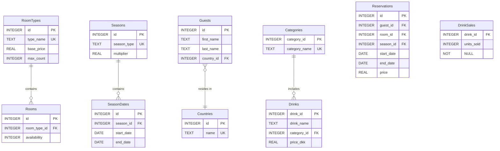

# Hotel Kong Arthur - Group 6


## Overview

Welcome to the **Hotel Kong Arthur - Group 6** GitHub Organization. Our team is tasked with developing an advanced data analytics platform for Hotel Kong Arthur to help optimize their operations. The system will enable hotel decision-makers to analyze key operational data in real time, providing insights on occupancy rates, revenue, customer satisfaction, and other important metrics.

This project leverages a microservice architecture to ensure scalability and flexibility. The backend is built using **Python** and **Flask**, and data is exchanged in **JSON** formatted and can export **CSV** format. For data visualization, we are integrating **Tableau** to provide clear, actionable insights.

## Project Goals

- **Optimize Hotel Operations**: Provide real-time data analysis on key hotel metrics.
- **Microservice Architecture**: Design the system as independent services that can be updated or scaled individually.
- **Technologies**: Python, Flask, JSON (CSV) for data exchange, and Tableau for data visualization.
- **Live Data Handling**: Build a system that updates and shows data in real time, moving away from the historical, static data found in the current system.

For a detailed description of the project requirements, visit our [Trello Board](https://trello.com/invite/b/6718aabe0e15a2c0ca0d5252/ATTIb2bb54308eb271203b88bb8a689a499b378BCD22/hotel-kong-arthur-group-6) and project description [Analyse af Hoteldata med Microservices, Tableau, SCRUM](https://github.com/user-attachments/files/17489442/Analyse.af.Hoteldata.med.Microservices.Tableau.Scrum.pdf).

## Project phases
This diagram illustrates the actual steps we took to execute the project, documenting our process from initial scoping to final visualization:


## Repository Structure

Each repository within this organization follows a **microservice pattern**, where each microservice is self-contained and fulfills a specific business function, such as managing guest data, room availability, or booking information. Below is an overview of our planned services:

### Microservices Overview

- **Guest Service**: Handles guest registration, profile updates, and preferences.
- **Reservation Service**: Manages room reservations/bookings, check-ins, and check-outs.
- **Room Inventory Service**: Manages room availability, types, and pricing.
- **Drink Service**: Handles drink orders from the bar, inventory, and billing for room service.
- **Drink Sales Service**: Tracks the number of drink units sold to ensure accurate inventory and financial reporting.
- **CSV Export Service**: Generates CSV files for data visualization from the aggregated data of various services. Ensures data is formatted correctly for tools like Tableau.
- **Hotel API Gateway**: Acts as a single entry point for client applications, routing requests to the appropriate microservices.

---

## Microservices Architecture
This diagram illustrates the comprehensive microservices architecture of our hotel management system. It shows how different services interact through an API Gateway, demonstrating the modular design and direct inter communication of the components.
- **Centralized API Gateway**: Provides a single entry point for all client requests, simplifying external communication
- **Separation of concerns (SoC)**: Each microservice focuses on a specific business function (guests, reservations, rooms, drinks) with independent responsibilities
- **Low Coupling**: Microservices operate independently with minimal dependencies, enabling easier maintenance, testing, and individual service updates
- **Direct inter communication**: Services communicate directly between themselves to reduce latency and network overhead, bypassing the API gateway for efficient data exchange


---
## Database Entity Relationships
This Entity-Relationship Diagram (ERD) provides a detailed view of our database schema, showcasing the relationships between different entities in our hotel management system.

- **Normalized Design**: Database schema minimizes data redundancy by breaking data into related tables, reducing storage waste and potential data inconsistencies
- **Scalability**: Foreign key relationships minimize data redundancy, enabling easy addition of new data (e.g., rooms, seasons, drinks) without extensive reorganization.
- **Database indexing**: Strategic indexing on primary and foreign keys to optimize query performance and reduce data retrieval times


---
## Data Sources

Our project integrates historical hotel data for development purposes, but the final system will handle live data feeds. Example data can be found in this repository: [Hotel Data](https://github.com/ITAKEA/hoteldata).

## Key Technologies

- **Backend**: Python with Flask and SQLite
- **Data Format**: JSON, CSV
- **Data Visualization**: Tableau
- **Architecture**: Microservices
- **Containerization**: Docker (for development and deployment)

# Microservices Setup with Docker

This document provides step-by-step instructions on setting up and running the microservices using Docker. 

## Set up with DockerHub

### Step 1: Pull Docker Images from Docker Hub

To get the pre-built Docker images for each microservice, run the following commands in your terminal:

```bash
# Pull the Docker images
docker pull marcusrk/hotel_api_gateway:latest
docker pull marcusrk/csv_export_service:latest
docker pull marcusrk/drink_sales_service:latest
docker pull marcusrk/drink_service:latest
docker pull marcusrk/reservation_service:latest
docker pull marcusrk/guest_service:latest
docker pull marcusrk/room_inventory_service:latest
```
### Step 2: Create a Docker Network
To enable inter-service communication between the microservices, create a custom Docker network:

```bash
docker network create microservice-network
```

### Step 3: Run the Docker Containers with Environment Variables
Now you can run each service in its own container, linking them to the microservice-network and configuring the necessary environment variables for inter-service communication:

```bash
# Run DrinkSalesService
docker run -d --name drink_sales_service \
  --network microservice-network \
  -p 5006:5006 \
  -e DRINK_SERVICE_URL=http://drink_service:5004 \
  marcusrk/drink_sales_service

# Run DrinkService
docker run -d --name drink_service \
  --network microservice-network \
  -p 5004:5004 \
  marcusrk/drink_service

# Run ReservationService
docker run -d --name reservation_service \
  --network microservice-network \
  -p 5003:5003 \
  -e GUEST_SERVICE_URL=http://guest_service:5001 \
  -e ROOM_INVENTORY_SERVICE_URL=http://room_inventory_service:5002 \
  marcusrk/reservation_service

# Run GuestService
docker run -d --name guest_service \
  --network microservice-network \
  -p 5001:5001 \
  marcusrk/guest_service

# Run RoomInventoryService
docker run -d --name room_inventory_service \
  --network microservice-network \
  -p 5002:5002 \
  marcusrk/room_inventory_service


# Run CSVExportService
docker run -d --name csv_export_service \
  --network microservice-network \
  -p 5005:5005 \
  -e GUEST_SERVICE_URL=http://guest_service:5001 \
  -e RESERVATION_SERVICE_URL=http://reservation_service:5003 \
  -e ROOM_INVENTORY_SERVICE_URL=http://room_inventory_service:5002 \
  -e DRINK_SERVICE_URL=http://drink_service:5004 \
  -e DRINK_SALES_SERVICE_URL=http://drink_sales_service:5006 \
  marcusrk/csv_export_service

# Run HotelAPIGateway
docker run -d --name hotel_api_gateway \
  --network microservice-network \
  -p 5010:5010 \
  -e GUEST_SERVICE_URL=http://guest_service:5001 \
  -e RESERVATION_SERVICE_URL=http://reservation_service:5003 \
  -e ROOM_INVENTORY_SERVICE_URL=http://room_inventory_service:5002 \
  -e DRINK_SERVICE_URL=http://drink_service:5004 \
  -e DRINK_SALES_SERVICE_URL=http://drink_sales_service:5006 \
  -e CSV_EXPORT_SERVICE_URL=http://csv_export_service:5005 \
  marcusrk/hotel_api_gateway
```

### Step 4: Verify Running Containers
To ensure that all services are running correctly, check the status of your containers:
```bash
docker ps
```

## Steps for Setting Up and Running Services locally

### 1. Clone Repositories

In your terminal, clone each microservice repository:

```bash
# Clone each repository and enter the base folder
git clone https://github.com/Gruppe-6-Hotel-Kong-Arthur/HotelAPIGateway.git
git clone https://github.com/Gruppe-6-Hotel-Kong-Arthur/CSVExportService.git
git clone https://github.com/Gruppe-6-Hotel-Kong-Arthur/DrinkSalesService.git
git clone https://github.com/Gruppe-6-Hotel-Kong-Arthur/DrinkService.git
git clone https://github.com/Gruppe-6-Hotel-Kong-Arthur/ReservationService.git
git clone https://github.com/Gruppe-6-Hotel-Kong-Arthur/GuestService.git
git clone https://github.com/Gruppe-6-Hotel-Kong-Arthur/RoomInventoryService.git
```

### 2. Build the Docker Images

Navigate to each microservice directory and build its Docker image, pruning unused images after the build:

```bash
# Build HotelAPIGateway
cd HotelAPIGateway
docker build -t hotel_api_gateway . && docker image prune -f
cd ..

# Build CSVExportService
cd CSVExportService
docker build -t csv_export_service . && docker image prune -f
cd ..

# Build DrinkSalesService
cd DrinkSalesService
docker build -t drink_sales_service . && docker image prune -f
cd ..

# Build DrinkService
cd DrinkService
docker build -t drink_service . && docker image prune -f
cd ..

# Build ReservationService
cd ReservationService
docker build -t reservation_service . && docker image prune -f
cd ..

# Build GuestService
cd GuestService
docker build -t guest_service . && docker image prune -f
cd ..

# Build RoomInventoryService
cd RoomInventoryService
docker build -t room_inventory_service . && docker image prune -f
cd ..
```

### 3. Create a Docker Network

Create a custom Docker network for inter-service communication:

```bash
docker network create microservice-network
```

### 4. Run the Docker Containers

Run each service in a container, linking them to the `microservice-network` and pruning stopped containers:

```bash
# Run HotelAPIGateway
docker rm -f hotel_api_gateway && docker run -d \
  --name hotel_api_gateway \
  --network microservice-network \
  -p 5010:5010 \
  hotel_api_gateway

# Run CSVExportService
docker rm -f csv_export_service && docker run -d \
  --name csv_export_service \
  --network microservice-network \
  -p 5005:5005 \
  csv_export_service

# Run DrinkSalesService
docker rm -f drink_sales_service && docker run -d \
  --name drink_sales_service \
  --network microservice-network \
  -p 5006:5006 \
  drink_sales_service

# Run DrinkService
docker rm -f drink_service && docker run -d \
  --name drink_service \
  --network microservice-network \
  -p 5004:5004 \
  drink_service

# Run ReservationService
docker rm -f reservation_service && docker run -d \
  --name reservation_service \
  --network microservice-network \
  -p 5003:5003 \
  reservation_service

# Run GuestService
docker rm -f guest_service && docker run -d \
  --name guest_service \
  --network microservice-network \
  -p 5001:5001 \
  guest_service

# Run RoomInventoryService
docker rm -f room_inventory_service && docker run -d \
  --name room_inventory_service \
  --network microservice-network \
  -p 5002:5002 \
  room_inventory_service
```

### 5. Verify Running Containers

Check that all services are running correctly:

```bash
docker ps
```

Or you can use Docker Desktop to verify the containers are running and connected to the `microservice-network`.


## Project Management

All project tasks, progress, and backlog items are tracked via our **Trello Board**. You can access the board [here](https://trello.com/invite/b/6718aabe0e15a2c0ca0d5252/ATTIb2bb54308eb271203b88bb8a689a499b378BCD22/hotel-kong-arthur-group-6).

## Team Members

| Name              | Role               | GitHub Profile                               |
|-------------------|--------------------|----------------------------------------------|
| **Marcus**        | (Unpaid) Intern      | [marcus-rk](https://github.com/marcus-rk)    |
| **Christian**     | Lead Developer, DevOps Senior Executive      | [ChristianBT96](https://github.com/ChristianBT96) |
